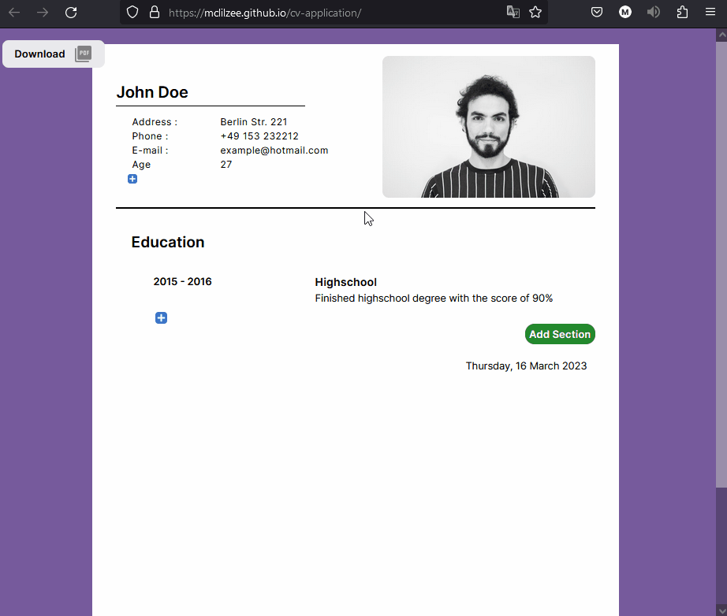
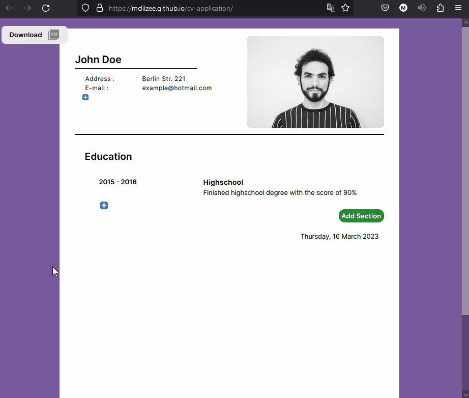
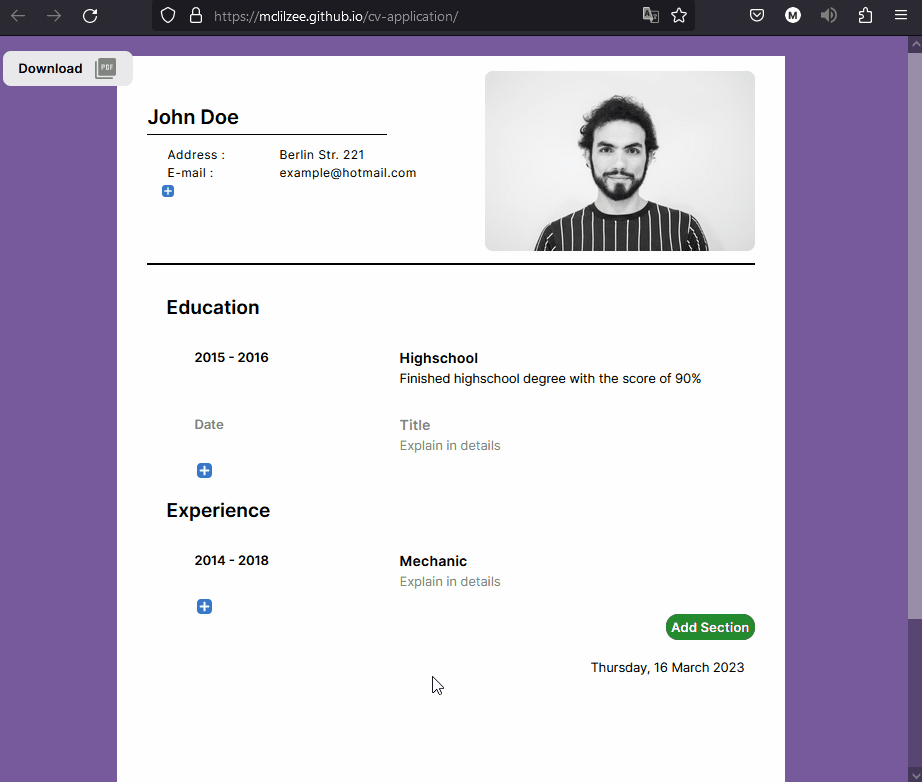
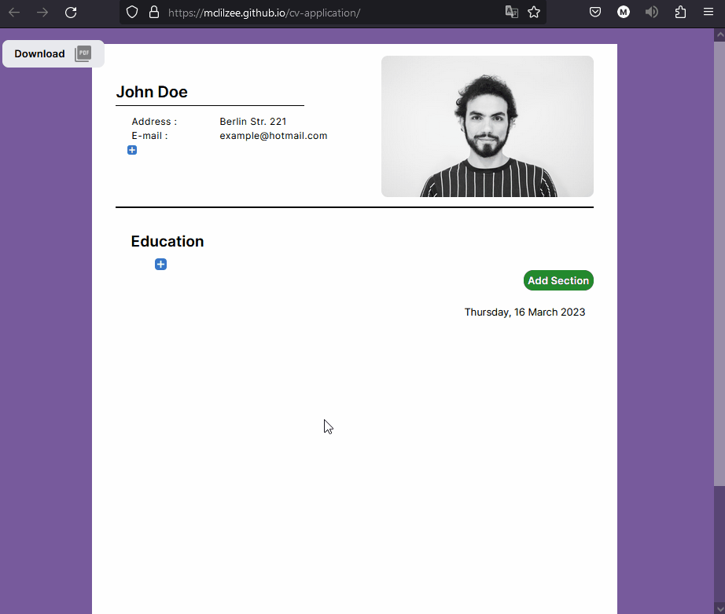
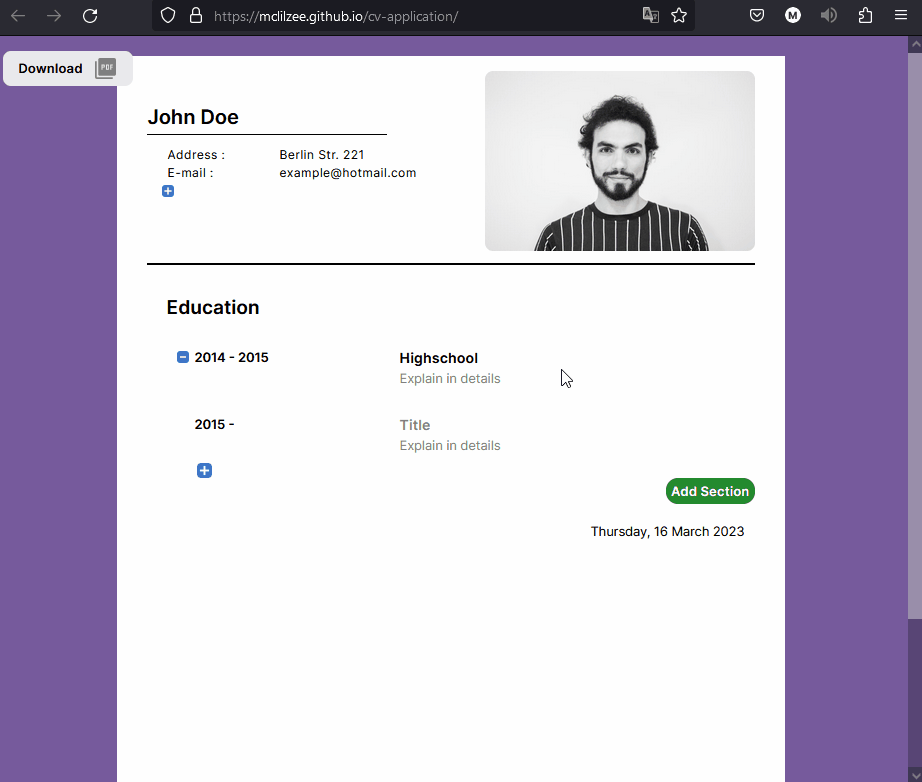

# <a href="https://mclilzee.github.io/cv-application">Cv Application Creator</a>
An application creator where you will be able to easily fill your information, select a profile picture and download the result as PDF.

To get started click on the title above, you will be taken to the live website. You can fill in your information, press on the `plus` sign to add more information, or on the `minus` sign to remove. You are able to add sections, remove sections, and have full control of how many or how little information you want on your application.

The website will be saved as local storage on your web-browser until it is cleaned from temp folders. This help by not losing your data when something happen or the browser gets closed by accident.

You will see more indepth detailed showcase in the examples bellow.

# Examples

### Adding personal information

### Remove personal information

### Adding Section

### Remove Section

### Adding iniformation in sections

### Remove information in sections

### Changing profile photo

### Download PDF

# Credit

### Profile Photo
<a href="https://unsplash.com/@sspaula?utm_source=unsplash&utm_medium=referral&utm_content=creditCopyText">Sergio de Paula</a> on <a href="https://unsplash.com/s/photos/person?utm_source=unsplash&utm_medium=referral&utm_content=creditCopyText">Unsplash</a>
